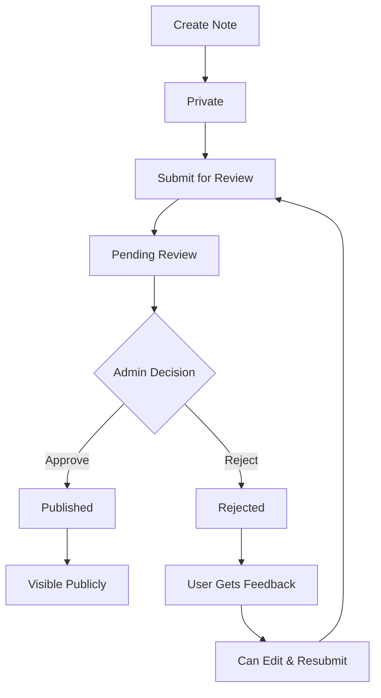

# Laravel Notes App with Public Publishing

A modern notes application built with Laravel 12, Inertia.js, React, and Tailwind CSS featuring user authentication, role-based access control, and community-driven content publishing with admin moderation.

## ✨ Features

### 🔐 **Authentication & Authorization**

- **Laravel Fortify** authentication (login, register, password reset, 2FA)
- **Role-based Access Control**: User and Admin roles
- **Policy-based Authorization** for secure resource management

### 📝 **Note Management**

- **Full CRUD Operations**: Create, Read, Update, Delete notes
- **Rich Text Content**: Support for multi-line content with proper formatting
- **Personal & Admin Views**: Users see their notes, admins see all notes
- **Pagination**: Efficient handling of large note collections

### 🌐 **Public Publishing System**

- **Publication Workflow**: Private → Pending → Published/Rejected
- **Community Sharing**: Approved notes visible to everyone
- **Admin Moderation**: Review queue with approval/rejection
- **Feedback System**: Admins provide review notes
- **Status Tracking**: Clear visual indicators for note states

### 🎨 **Modern UI/UX**

- **Tailwind CSS v4** styling with custom design system
- **Responsive Design**: Works perfectly on all devices
- **shadcn/ui Components**: Professional component library
- **Dark/Light Mode Support**: Built-in theme switching
- **Type-Safe Routing**: Laravel Wayfinder integration

## 🚀 **Quick Start**

### Prerequisites

- PHP 8.4+
- Node.js 18+
- Composer
- SQLite (or your preferred database)

### Installation

1. **Clone & Install**

    ```bash
    composer install
    npm install
    ```

2. **Environment Setup**

    ```bash
    cp .env.example .env
    php artisan key:generate
    ```

3. **Database Setup**

    ```bash
    php artisan migrate:fresh --seed
    ```

4. **Build & Start**

    ```bash
    composer run dev
    ```

5. **Access the App**
    - Main app: http://127.0.0.1:8000
    - Public notes: http://127.0.0.1:8000/public-notes

## 👥 **Test Accounts**

### Admin Account

- **Email**: `admin@example.com`
- **Password**: `password`
- **Access**: Full admin features + pending review queue

### Regular Users

- **Email**: `user@example.com`, `jane@example.com`, `bob@example.com`
- **Password**: `password`
- **Access**: Personal notes + publishing submission

## 📋 **How Publishing Works**

### For Users

1. **Create Note** (private by default)
2. **Submit for Review** → Click "Publish" button
3. **Admin Review** → Wait for approval/rejection
4. **Get Feedback** → Review notes from admin
5. **Resubmit if Needed** → Edit and submit again

### For Admins

1. **Review Queue** → `/admin/pending-notes`
2. **Evaluate Content** → Read submission carefully
3. **Approve/Reject** → With detailed feedback
4. **Publish** → Make approved notes public

## 🗂️ **Project Structure**

```
app/
├── Http/Controllers/
│   └── NoteController.php          # CRUD + Publishing logic
├── Models/
│   ├── Note.php                    # Note model with status helpers
│   └── User.php                    # User model with role methods
└── Policies/
    └── NotePolicy.php              # Authorization policies

resources/js/
├── components/ui/                  # shadcn/ui components
├── layouts/                        # App layouts
└── pages/
    ├── notes/
    │   ├── index.tsx               # User note management
    │   ├── create.tsx              # Create new notes
    │   ├── edit.tsx                # Edit existing notes
    │   ├── show.tsx                # View single note
    │   ├── public.tsx              # Community notes (no auth)
    │   └── pending.tsx             # Admin review interface
    ├── dashboard.tsx               # User dashboard
    └── welcome.tsx                 # Landing page

routes/
└── web.php                         # All application routes

database/
├── migrations/                     # Database schema changes
├── seeders/                        # Sample data
└── factories/                      # Model factories
```

## 🛠️ **Key Technologies**

| Component         | Technology        | Version |
| ----------------- | ----------------- | ------- |
| **Backend**       | Laravel           | 12.x    |
| **Frontend**      | React             | 19.x    |
| **Language**      | TypeScript        | 5.x     |
| **Styling**       | Tailwind CSS      | 4.x     |
| **SPA Framework** | Inertia.js        | v2      |
| **Auth**          | Laravel Fortify   | v1      |
| **Routing**       | Laravel Wayfinder | v0      |
| **Testing**       | Pest              | v4      |
| **Code Quality**  | Laravel Pint      | v1      |

## 📊 **Database Schema**

### Users Table

```sql
- id: integer (primary)
- name: varchar
- email: varchar (unique)
- password: varchar (hashed)
- role: enum('user', 'admin') default 'user'
- email_verified_at: datetime (nullable)
- created_at/updated_at: timestamps
- Two-factor auth columns (Fortify)
```

### Notes Table

```sql
- id: integer (primary)
- user_id: integer (foreign key)
- title: varchar
- content: text
- status: enum('private', 'pending', 'published', 'rejected')
- published_at: datetime (nullable)
- reviewed_by: integer (foreign key, nullable)
- review_notes: text (nullable)
- created_at/updated_at: timestamps
```

## 🧪 **Testing**

```bash
# Run all tests
php artisan test

# Run with coverage
php artisan test --coverage

# Run specific feature
php artisan test --filter=NoteTest
```

## 📝 **API Routes**

### Public Routes (No Auth Required)

- `GET /` - Welcome page
- `GET /public-notes` - Browse published community notes

### Authentication Routes (Fortify)

- `GET /login` - Login page
- `GET /register` - Registration page
- `POST /login` - Authenticate user
- `POST /register` - Create account

### Protected Routes (Auth Required)

- `GET /dashboard` - User dashboard
- `GET /notes` - User's personal notes
- `GET /notes/create` - Create note form
- `POST /notes` - Store new note
- `GET /notes/{note}` - View specific note
- `GET /notes/{note}/edit` - Edit note form
- `PUT /notes/{note}` - Update note
- `DELETE /notes/{note}` - Delete note
- `POST /notes/{note}/submit` - Submit for publication

### Admin Routes (Auth + Admin Role)

- `GET /admin/pending-notes` - Review pending submissions
- `POST /admin/notes/{note}/approve` - Approve note
- `POST /admin/notes/{note}/reject` - Reject note

## 🏗️ **Development Commands**

```bash
# Start development server (Laravel + Vite)
composer run dev

# Generate Wayfinder routes after changes
php artisan wayfinder:generate --with-form

# Code formatting
vendor/bin/pint --dirty --format agent

# Type checking (if configured)
npm run typecheck

# Build for production
npm run build

# Run tests
php artisan test --compact

# Database operations
php artisan migrate:fresh --seed
php artisan db:seed
```

## 🔧 **Publishing Workflow Code**

### Submit Note for Review

```php
public function submitForReview(Note $note): RedirectResponse
{
    $this->authorize('update', $note);

    if (!$note->canBePublished()) {
        return back()->with('error', 'Cannot submit this note');
    }

    $note->update(['status' => Note::STATUS_PENDING]);
    return redirect()->route('notes.index')
        ->with('success', 'Submitted for review!');
}
```

### Admin Approval

```php
public function approve(Note $note, Request $request): RedirectResponse
{
    $this->authorize('admin', Note::class);

    $note->update([
        'status' => Note::STATUS_PUBLISHED,
        'published_at' => now(),
        'reviewed_by' => Auth::id(),
        'review_notes' => $request->review_notes,
    ]);

    return redirect()->route('notes.pending')
        ->with('success', 'Note published!');
}
```

### Frontend Status Display

```tsx
const getStatusBadge = (status: string) => {
    switch (status) {
        case 'private':
            return <Badge variant="outline">Private</Badge>;
        case 'pending':
            return <Badge variant="secondary">Pending Review</Badge>;
        case 'published':
            return <Badge variant="default">Published</Badge>;
        case 'rejected':
            return <Badge variant="destructive">Rejected</Badge>;
    }
};
```

## 🎯 **Sample Data**

The seeder creates realistic sample data:

- **4 Users**: 1 Admin, 3 Regular users
- **12 Notes**: Mix of private, pending, published, and rejected
- **Published Notes**: Community content with admin reviews
- **Pending Reviews**: Submissions waiting for approval
- **Rejected Notes**: With detailed feedback

## 🚦 **Status Flow**



## 📚 **Learn More**

- [Laravel 12 Documentation](https://laravel.com/docs/12.x)
- [Inertia.js v2 Guide](https://inertiajs.com/)
- [Tailwind CSS v4](https://tailwindcss.com/)
- [Laravel Fortify](https://laravel.com/docs/12.x/fortify)
- [Laravel Wayfinder](https://github.com/laravel/wayfinder)
- [shadcn/ui](https://ui.shadcn.com/)

## 🤝 **Contributing**

1. Fork the repository
2. Create a feature branch (`git checkout -b feature/amazing-feature`)
3. Commit changes (`git commit -m 'Add amazing feature'`)
4. Push to branch (`git push origin feature/amazing-feature`)
5. Open a Pull Request

## 📄 **License**

This project is open-sourced software licensed under the [MIT license](LICENSE).

---

**Built with ❤️ using Laravel 12, React 19, and modern web technologies**
